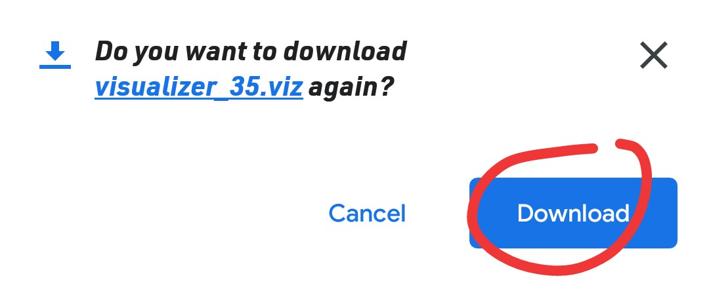
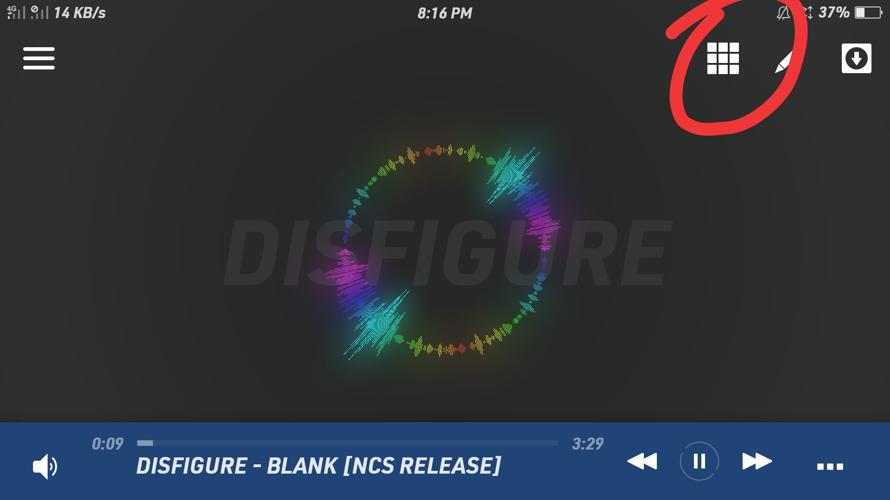
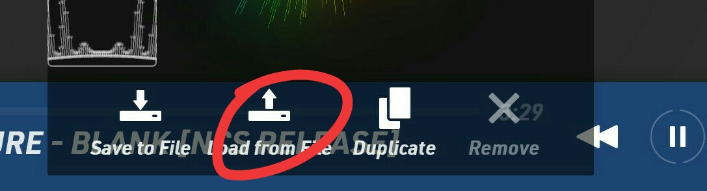
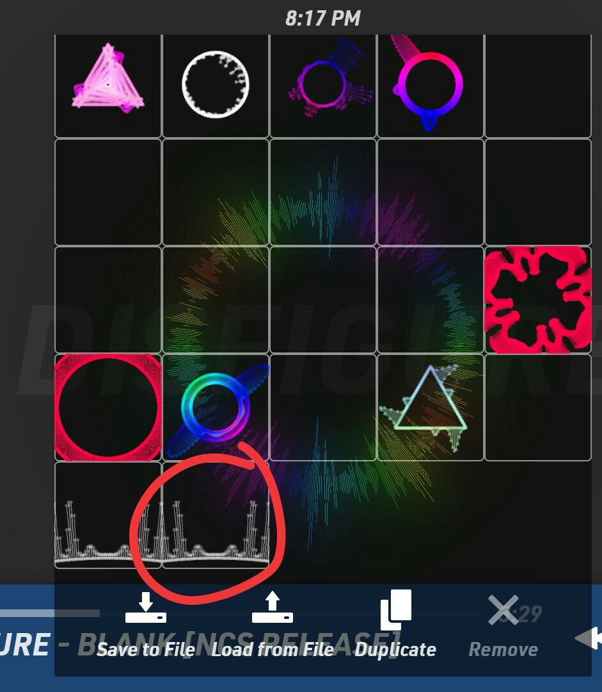

# nightcore-visualizer
Nightcore Visualizer for Avee Player

## How to install?

> 1. click visualizer_35.viz
>

> 2. click view raw
>

> 3. download it
>

> 4. open avee player
> 5. click this
>

> 6. click load from file
>

> 7. select visualizer_35.viz
>

> 8. once youre done. click this
>

